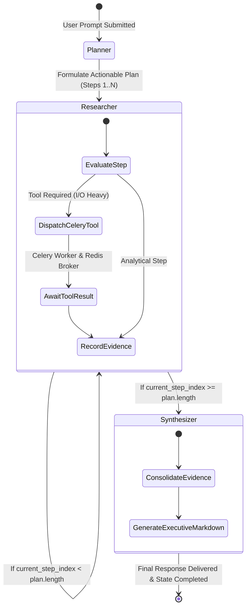

# Multi-Agent AI Orchestration System — Evaluation & System Design Document

This document provides an in-depth architectural breakdown of the **Stateful Multi-Agent AI Orchestration System**, detailing the orchestration engine selection, agent role definitions, tool schemas, persistence strategy, and distributed asynchronous execution.

---

## 1. Chosen Orchestration Pattern: LangGraph vs. Microsoft AutoGen

### Selection: LangGraph (StateGraph)

For this production-grade multi-agent system, **LangGraph** was selected as the core orchestration framework over Microsoft AutoGen.

### Rationale and Trade-off Analysis

| Evaluation Criterion | LangGraph | Microsoft AutoGen | Decision Factor |
| :--- | :--- | :--- | :--- |
| **State Machine Topology** | **Deterministic Graph (Nodes & Edges)**: Explicitly defines nodes (`Planner`, `Researcher`, `Synthesizer`) and conditional routing edges. | **Conversational / GroupChat**: Relies on turn-taking managers and multi-turn conversational chatter. | LangGraph ensures predictable execution order, preventing agent looping or diverging conversations. |
| **State Transparency & Auditability** | **TypedDict / Pydantic State**: The entire state snapshot is explicit, immutable per step, and easily serializable to PostgreSQL and WebSockets. | State is implicit in the conversational chat history across agent instances. | Storing granular audit events (`AGENT_THOUGHT`, `TOOL_INVOCATION`, `TOOL_RESULT`) in PostgreSQL requires a strictly typed state dictionary. |
| **Async & Distributed Integration** | Native first-class async runtime with `ainvoke` / `astream`, perfectly fitting Celery task offloading and FastAPI async background tasks. | Historically synchronous with async wrappers; more friction when dispatching to external Celery workers. | Prevents blocking FastAPI's ASGI event loop while waiting for distributed worker tool completions. |
| **Conditional Looping** | Conditional edge (`should_continue_research`) loops through research steps until `current_step_index == len(plan)`. | GroupChat speaker selection can result in unpredictable speaker turns or early termination. | Guarantees that every planned step is executed before transitioning to the Synthesizer. |

### Graph Topology



---

## 2. Agent Roles, Responsibilities, and System Prompts

The system orchestrates **three distinct, specialized AI agents**, each with dedicated system prompts and narrow context boundaries.

### Agent 1: Strategic Planner
- **Role**: High-level problem deconstruction and sequencing.
- **Responsibilities**:
  - Breaks user objectives down into 2 to 4 discrete, structured steps.
  - Determines which tool (`web_search`, `weather_search`, `calculator`) is best suited for each step.
  - Generates arguments for the chosen tools.
- **System Prompt**:
```text
You are the Lead Strategic Planner Agent in an autonomous multi-agent orchestration system.
Your responsibility is to analyze a complex user prompt, break it down into an ordered series of 2 to 4 actionable, logical steps, and determine if external tools are required.

Available Tools:
1. web_search:
   - Args: {"query": string, "max_results": integer (1-10)}
   - Best for: Real-time information, facts, articles, documentation, trends.
2. weather_search:
   - Args: {"location": string (e.g. "Tokyo, Japan"), "units": "metric" or "imperial"}
   - Best for: Current weather, temperature, forecasts for packing or travel advice.
3. calculator:
   - Args: {"expression": string (e.g. "1500 * (1 + 0.08)**5"), "description": string}
   - Best for: Mathematical, financial, compounding, or statistical computations.

Output Format:
You MUST return ONLY a valid JSON object with NO markdown fence formatting or additional commentary.
Structure:
{
  "thought": "Brief explanation of your planning reasoning",
  "steps": [
    {
      "step_number": 1,
      "title": "Short title of step",
      "description": "What specifically needs to be investigated or computed",
      "tool_name": "weather_search" | "web_search" | "calculator" | null,
      "tool_args": {"arg_key": "arg_value"}
    }
  ]
}
```

### Agent 2: Specialized Researcher & Tool Operator
- **Role**: Execution of operational sub-tasks and tool interactions.
- **Responsibilities**:
  - Dispatches tool invocations to the Celery distributed task queue over Redis.
  - Parses and validates raw tool responses.
  - Intercepts and isolates tool errors, converting exceptions into actionable diagnostic feedback so the workflow never crashes.
  - Maintains structured `research_data` evidence entries.
- **System Prompt**:
```text
You are the Specialized Research & Tool Execution Agent.
Your responsibility is to execute investigation steps, interpret raw tool output, handle edge cases or partial errors, and summarize meaningful evidence for the synthesizing writer.

When evaluating tool results:
- If the tool succeeded: extract the key findings directly relevant to the user's objective.
- If the tool failed or returned an error: diagnose what went wrong and explain how to proceed with best-effort reasoning.
- Maintain objectivity and precision.
```

### Agent 3: Executive Synthesizer & Writer
- **Role**: Evidence collation, reasoning reconciliation, and final deliverable generation.
- **Responsibilities**:
  - Reviews the original prompt, formulated plan, and all accumulated research evidence.
  - Resolves any discrepancies or missing information.
  - Drafts an authoritative, beautifully structured Markdown response with actionable conclusions.
- **System Prompt**:
```text
You are the Senior Executive Synthesizer & Writer Agent.
Your responsibility is to review the original user request, the tactical plan, and all gathered research evidence and tool results, and synthesize a cohesive, comprehensive, and polished response.

Formatting Guidelines:
- Use clean Markdown with structured headings, bullet points, and highlighted takeaways.
- Explicitly answer all components of the user prompt.
- Incorporate concrete data points discovered during the research phase (e.g., exact temperatures, calculations, or search findings).
- Provide practical recommendations and next steps.
```

---

## 3. Custom Tools: Schemas, Outputs, and Error Handling

The application provides three custom tools built with strict **Pydantic v2 schemas** and internal try/catch boundaries.

### Tool 1: Web Search Tool (`web_search`)
- **Purpose**: Retrieves real-time articles, web pages, and recent knowledge.
- **Pydantic Input Schema**:
```python
class WebSearchInput(BaseModel):
    query: str = Field(description="The precise search query to search across the web.")
    max_results: int = Field(default=5, ge=1, le=10, description="Max search results (1-10).")
```
- **Expected Output**: Formatted bulleted text containing result titles, content snippets, and source URLs.
- **Error Handling Strategy**:
  - Network timeouts and rate limits (`DDGS` throttles) are intercepted via `try...except Exception`.
  - Empty or unresolvable queries return an informative fallback notice: `"Notice: Web search service encountered an external issue (...). The agent should proceed using relevant domain knowledge."`
  - Prevents fatal Python process exits.

### Tool 2: Weather Search Tool (`weather_search`)
- **Purpose**: Retrieves live meteorological data, current temperatures, wind speeds, and 3-day forecasts for any global city.
- **Pydantic Input Schema**:
```python
class WeatherSearchInput(BaseModel):
    location: str = Field(description="The city name and optional country code (e.g., 'Tokyo, Japan').")
    units: str = Field(default="metric", description="Units: 'metric' (Celsius) or 'imperial' (Fahrenheit).")
```
- **Expected Output**: Structured report with weather conditions (e.g., "Partly cloudy", "Rain showers"), current temperature with units, wind speed, and a 3-day forecast with daily highs, lows, and precipitation probabilities.
- **Error Handling Strategy**:
  - Two-stage API fallback: Geocodes location using Open-Meteo Geocoding API; if city is not found, returns `"Error: Location '{location}' not found. Please provide a recognized city name."`
  - HTTP errors and connection timeouts return clean error descriptions allowing the agent to adjust its plan.

### Tool 3: Mathematical & Financial Calculator Tool (`calculator`)
- **Purpose**: Evaluates algebraic, financial (compound interest, CAGR), and statistical computations.
- **Pydantic Input Schema**:
```python
class CalculatorInput(BaseModel):
    expression: str = Field(description="A mathematical or statistical expression to safely evaluate.")
    description: Optional[str] = Field(default=None, description="Optional brief context of the calculation.")
```
- **Expected Output**: String formatted with calculation result and context, e.g. `"Calculation Result (5-year growth): 1000 * (1 + 0.12)**5 = 1762.34"`.
- **Error Handling Strategy**:
  - **Security / AST Parsing**: Rather than using unsafe `eval()`, the calculator parses the string using Python's `ast` (Abstract Syntax Tree) with an explicit whitelist of safe operators (`+`, `-`, `*`, `/`, `**`, `//`, `%`) and functions (`sqrt`, `sin`, `cos`, `log`, `round`, `abs`, `sum`, `min`, `max`).
  - Catches `ZeroDivisionError` -> `"Math Error: Division by zero encountered in expression."`
  - Catches `SyntaxError` -> `"Syntax Error: Could not parse mathematical expression."`
  - Prevents arbitrary code execution vulnerabilities.

---

## 4. Distributed Task Offloading via Celery & Redis

To prevent I/O-intensive tools (e.g., web scraping or external API calls) from blocking the FastAPI ASGI event loop:
1. All tool executions are wrapped in a Celery task:
   ```python
   @celery_app.task(name="execute_tool_task", bind=True)
   def execute_tool_task(self, tool_name: str, kwargs: dict) -> dict: ...
   ```
2. The LangGraph `Researcher` node calls `dispatch_tool_execution(tool_name, tool_args)`.
3. This dispatches `.delay()` to Redis broker `redis://redis:6379/0`.
4. Celery worker consumes the task, executes the tool, and writes the output to the Redis result backend.
5. FastAPI awaits completion using non-blocking async sleeps (`await asyncio.sleep(0.2)`), allowing other WebSocket connections and REST requests to be processed concurrently.

---

## 5. Auditability and State Persistence via PostgreSQL

Two relational models ensure full traceability of all multi-agent actions:
1. **`task_runs`**:
   - `id` (UUID Primary Key)
   - `prompt` (Original user prompt)
   - `status` (`PENDING`, `RUNNING`, `COMPLETED`, `FAILED`)
   - `final_result` (Final synthesized Markdown)
   - `created_at`, `updated_at` (Timestamps with timezone)
2. **`agent_events`**:
   - `id` (UUID Primary Key)
   - `task_run_id` (Foreign Key referencing `task_runs.id`)
   - `agent_name` (`Planner`, `Researcher`, `Synthesizer`, `System`)
   - `event_type` (`AGENT_THOUGHT`, `STATE_TRANSITION`, `TOOL_INVOCATION`, `TOOL_RESULT`, `COMPLETE`, `ERROR`)
   - `payload` (JSON/JSONB storing full parameters, plans, or tool inputs/outputs)
   - `timestamp` (Indexed chronological timestamp)

---

## 6. Real-Time Streaming Architecture via WebSockets

```
[React UI] <====(WebSocket /api/ws/{task_id})====> [FastAPI ConnectionManager]
                                                            ^
                                                            | (async event callback)
                                                   [LangGraph Nodes]
```

- When a client connects, any existing events recorded in PostgreSQL are first replayed, enabling seamless page refreshes without losing execution state.
- During execution, the event callback pushes structured JSON frames across the WebSocket connection.
- A 15-second heartbeat loop prevents proxy or Docker network timeouts while long-running tool tasks are in flight.
